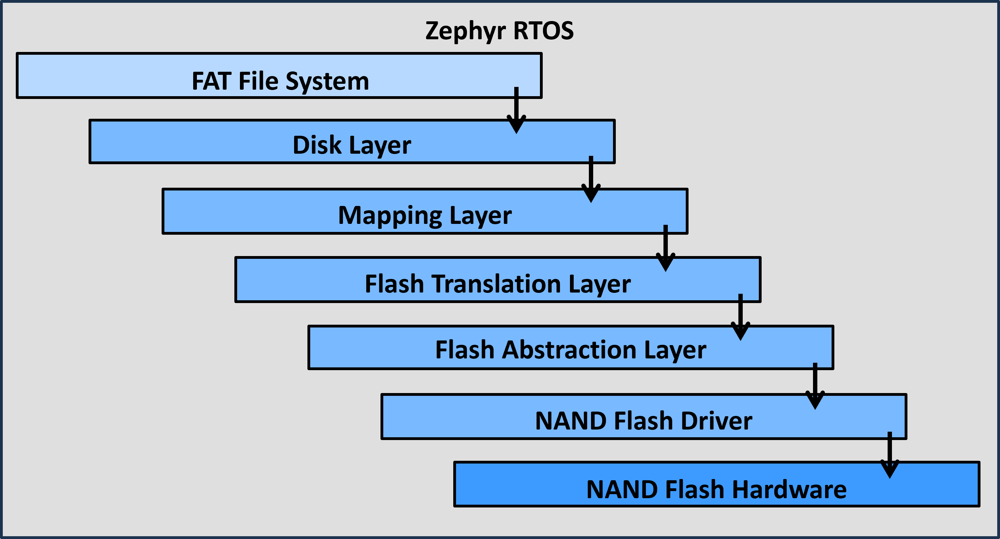

# Integration of NAND Flashes in Zephyr with the Flash Translation Layer DHARA

## Table of Contents

1. [Introduction](#introduction)
2. [Prerequisites](#prerequisites)
3. [Setup and Configuration](#setup-and-configuration)
   - [Hardware Setup](#hardware-setup)
   - [Software Setup](#software-setup)
      - [Handle Implementation](#handle-implementation)
4. [Theory Corner](#theory-corner)
   - [NAND Flash Multistack Implementation](#nand-flash-multistack-implementation)
   - [DHARA](#dhara)
5. [Troubleshooting](#troubleshooting)
6. [References](#references)

## Introduction

This guide provides a comprehensive overview of integrating NAND flash memory in the Zephyr RTOS using the DHARA Flash Translation Layer (FTL). The integration ensures reliable storage management, wear leveling, and error correction, making it suitable for embedded applications requiring non-volatile storage.

## Prerequisites

- **Hardware**: For example the nrf5340dk in combination with an external test bench.
- **Software**:
  - Zephyr RTOS
  - VS Code
  - nrf Connect in VS Code
- **Tools**:
  - Git
  - CMake
  - West
  - A supported compiler (e.g., GCC)

## Setup and Configuration

### Hardware Setup

1. **Connect NAND Flash**: Ensure the NAND flash is correctly connected to the development board according to the following illustration.
2. **Verify Connections**: Double-check the connections, especially the data lines, control signals, and power supply.


### Software Setup
1. **Set Up Zephyr**:
    Follow the [Zephyr Getting Started Guide](https://docs.zephyrproject.org/latest/getting_started/index.html) to install and set up the Zephyr SDK.
2. **Add the nrf Connect extension in VS Code**:
    Install the nrf Connect extension in Visual Studio Code for seamless development and flashing.
3. **Build and flash the repository**:
    ```sh
    west build -p --board nrf5340dk_nrf5340_cpuapp
    west flash
    ```

Adjustments can either be created in the device tree for the SPI or in the overlay.

#### Handle Implementation
The handle implementation is demonstrated in an example file, `example_handle.c`, which uses SPI to communicate with the actual hardware. This example is designed to be adaptable to different communication protocols and logging mechanisms. Here are the key points that one needs to take into account if the projects should be embedded in their project:

1. **Example Handle (`example_handle.c`)**:
   - This file provides a sample implementation of a handle that communicates with the hardware using SPI.
   - It defines the necessary function pointers for communication (`transceive`) and logging (`log`).

2. **Customizable Functions**:
   - **Transceive Function**: 
     - This function handles the transmission and reception of data over the chosen communication protocol (in this case, SPI).
     - It is designed to be protocol-agnostic, meaning it can be modified to support other communication protocols as needed.
     - Users can customize this function to suit their specific requirements for data transfer.

   - **Log Function**: 
     - This function is responsible for logging messages, including errors and informational logs.
     - It is also designed to be flexible, allowing users to implement their own logging mechanism as per their needs.

    - **Wait Function**: 
     - This function is responsible for the waiting in microseconds after requesting data from the NAND flash.
     - It is also designed to be flexible, allowing users to implement a non blocking waiting function, considering a precision of microseconds.


3. **Device Tree Configuration**:
   - For the NAND flash multistack implementation to recognize the device, it must be labeled as `nand_device` in the Device Tree Source (DTS) configuration.
   - The DTS configuration provides the necessary hardware information to the implementation, ensuring that the correct device is used.
   - Notably, only the disk layer interacts with the device tree to retrieve this information, ensuring that the rest of the implementation remains agnostic of the specific hardware details.


## Theory Corner

### NAND Flash Multistack Implementation

NAND flash memory is a type of non-volatile storage technology that does not require power to retain data. It is commonly used in various storage applications due to its high density and low cost. Multistack implementation in NAND flash refers to how the integration is provided in multiple layers to accomodate for the three main challenges (wear levelling, bad block management, ECC).




### DHARA

DHARA is a Flash Translation Layer (FTL) designed to provide a reliable storage solution on top of NAND flash memory. It abstracts the complexities of NAND flash management, such as wear leveling, bad block management, and garbage collection.

Key Concepts:
- **Wear Leveling**: Distributes write and erase cycles evenly across the NAND flash to extend its lifespan.
- **Bad Block Management**: Identifies and manages defective blocks to prevent data loss.
- **Garbage Collection**: Reclaims space from invalid or deleted data to optimize storage utilization.
- **Mapping Layer**: Translates logical addresses used by the file system to physical addresses on the NAND flash.

## Troubleshooting

- **Compilation Issues**:
  - Ensure all dependencies are correctly included in your `CMakeLists.txt`.
  - Verify that your development environment is set up according to the [Zephyr Getting Started Guide](https://docs.zephyrproject.org/latest/getting_started/index.html).

- **Runtime Errors**:
  - Use debugging tools to inspect the state of the NAND flash and DHARA FTL.
  - Check the connections and ensure that the hardware setup matches the provided illustration.

- **Performance Issues**:
  - Profile the application to identify bottlenecks and optimize the NAND flash access patterns.
  - Adjust the configuration settings in the DHARA FTL to better suit your application's needs.

## References

- [Zephyr Project Documentation](https://docs.zephyrproject.org/latest/index.html)
- [DHARA GitHub Repository](https://github.com/dlbeer/dhara.git)
- [NAND Flash Memory Overview](https://en.wikipedia.org/wiki/Flash_memory#NAND_flash)
- [nRF Connect for VS Code](https://www.nordicsemi.com/Products/Development-tools/nRF-Connect-for-VS-Code)
- [Getting Started with nRF5340 DK](https://infocenter.nordicsemi.com/index.jsp?topic=%2Fug_nrf5340.html)

---

### QUESTIONS?
Contact: Denis Buckingham denisb@ethz.ch
