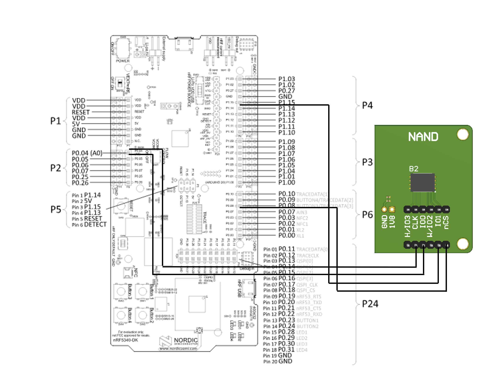

# Integration of NAND Flashes in Zephyr with the Flash Translation Layer DHARA

## Table of Contents

1. [Introduction](#introduction)
2. [Prerequisites](#prerequisites)
3. [Setup and Configuration](#setup-and-configuration)
   - [Hardware Setup](#hardware-setup)
   - [Software Setup](#software-setup)
4. [Theory Corner](#theory-corner)
   - [NAND Flash Multistack Implementation](#nand-flash-multistack-implementation)
   - [DHARA](#dhara)
5. [Troubleshooting](#troubleshooting)
6. [References](#references)

## Introduction

This guide provides a comprehensive overview of integrating NAND flash memory in the Zephyr RTOS using the DHARA Flash Translation Layer (FTL). The integration ensures reliable storage management, wear leveling, and error correction, making it suitable for embedded applications requiring non-volatile storage.

## Prerequisites

- **Hardware**: For example the nrf5340dk in combination with an external test bench.
- **Software**:
  - Zephyr RTOS
  - VS Code
  - nrf Connect in VS Code
- **Tools**:
  - Git
  - CMake
  - West
  - A supported compiler (e.g., GCC)

## Setup and Configuration

### Hardware Setup

1. **Connect NAND Flash**: Ensure the NAND flash is correctly connected to the development board according to the following illustration.
2. **Verify Connections**: Double-check the connections, especially the data lines, control signals, and power supply.



### Software Setup
1. **Set Up Zephyr**:
    Follow the [Zephyr Getting Started Guide](https://docs.zephyrproject.org/latest/getting_started/index.html) to install and set up the Zephyr SDK.
2. **Add the nrf Connect extension in VS Code**:
    Install the nrf Connect extension in Visual Studio Code for seamless development and flashing.
3. **Build and flash the repository**:
    ```sh
    west build -p --board nrf5340dk_nrf5340_cpuapp
    west flash
    ```

Adjustments can either be created in the device tree for the SPI or in the overlay.

## Theory Corner

### NAND Flash Multistack Implementation

NAND flash memory is a type of non-volatile storage technology that does not require power to retain data. It is commonly used in various storage applications due to its high density and low cost. Multistack implementation in NAND flash refers to how the integration is provided in multiple layers to accomodate for the three main challenges (wear levelling, bad block management, ECC).


### DHARA

DHARA is a Flash Translation Layer (FTL) designed to provide a reliable storage solution on top of NAND flash memory. It abstracts the complexities of NAND flash management, such as wear leveling, bad block management, and garbage collection.

Key Concepts:
- **Wear Leveling**: Distributes write and erase cycles evenly across the NAND flash to extend its lifespan.
- **Bad Block Management**: Identifies and manages defective blocks to prevent data loss.
- **Garbage Collection**: Reclaims space from invalid or deleted data to optimize storage utilization.
- **Mapping Layer**: Translates logical addresses used by the file system to physical addresses on the NAND flash.

## Troubleshooting

- **Compilation Issues**:
  - Ensure all dependencies are correctly included in your `CMakeLists.txt`.
  - Verify that your development environment is set up according to the [Zephyr Getting Started Guide](https://docs.zephyrproject.org/latest/getting_started/index.html).

- **Runtime Errors**:
  - Use debugging tools to inspect the state of the NAND flash and DHARA FTL.
  - Check the connections and ensure that the hardware setup matches the provided illustration.

- **Performance Issues**:
  - Profile the application to identify bottlenecks and optimize the NAND flash access patterns.
  - Adjust the configuration settings in the DHARA FTL to better suit your application's needs.

## References

- [Zephyr Project Documentation](https://docs.zephyrproject.org/latest/index.html)
- [DHARA GitHub Repository]([https://github.com/dvhart/dhara](https://github.com/dlbeer/dhara.git))
- [NAND Flash Memory Overview](https://en.wikipedia.org/wiki/Flash_memory#NAND_flash)
- [nRF Connect for VS Code](https://www.nordicsemi.com/Software-and-tools/Development-Tools/nRF-Connect-for-Visual-Studio-Code)
- [Getting Started with nRF5340 DK](https://infocenter.nordicsemi.com/index.jsp?topic=%2Fug_nrf5340.html)

---

This README provides a step-by-step guide to integrating NAND flash memory with the DHARA Flash Translation Layer in Zephyr. It covers the setup, configuration, integration, example usage, testing, and troubleshooting to ensure a smooth implementation.
